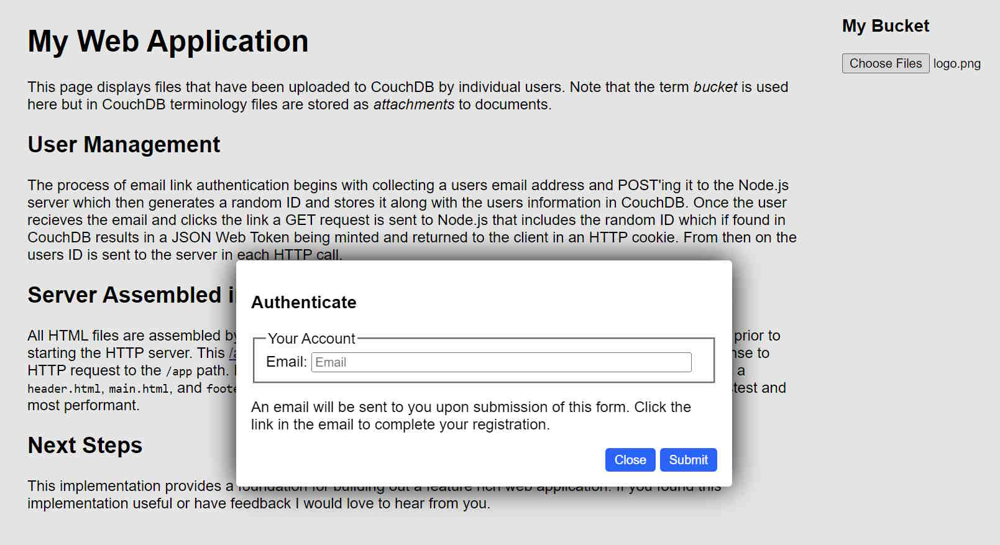
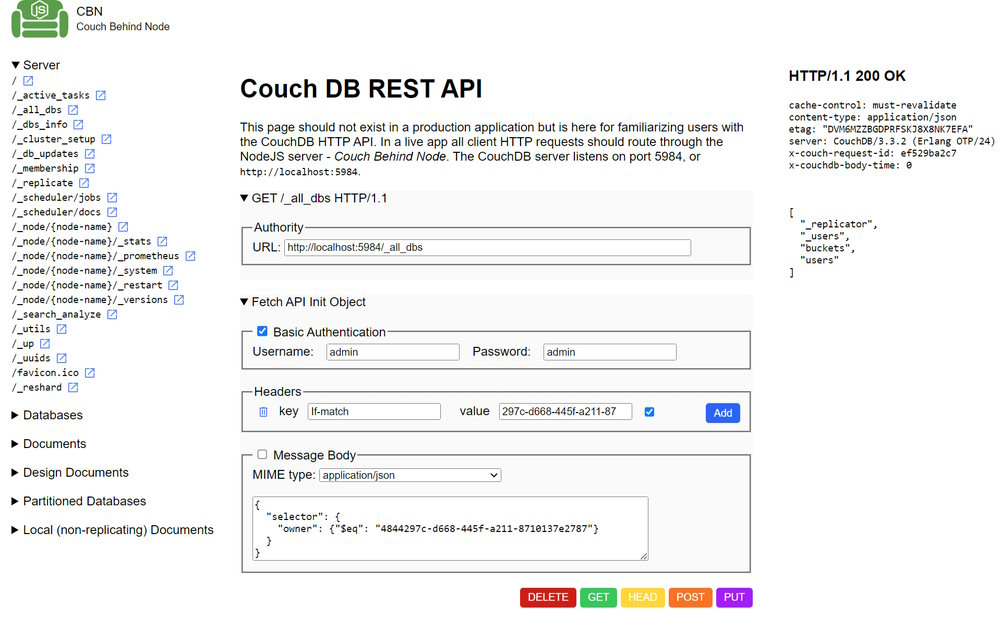

# Couch Behind Node
 - Authentication, Authorization, Accounting for CouchDB
 - Framework free, library free web service system 
 - Containerized w/ NGINX front end
 - Great starting point for your next web app project
 - Launch all three servers with single command
 - HTTP API playground familiarizes users with CouchDB

## Summary
JSON Web Tokens minted from email link authentication delivers client side session management. Single "docker compose up" command launches open source nginx, nodejs, and couchdb servers configured with host folders bind mounted enabling live code updates (e.g. nodemon) without requiring container restarts/rebuilds.

Nginx is the front end reverse proxy cache engine. Nodejs' http module is minimally configured as a web server and crypto library issues and verifies JWT's. CouchDB is the document database.



## Getting Started

### 1. Install Docker on the Host
Install Docker Desktop or Docker Engine on the host computer. The Docker software is available at https://www.docker.com/.

### 2. Install and Initialize Git on the Host
Install and then initialize Git on the host computer by issuing `git init`. Clone this repository to your host.

### 3. Create `.env` file in root folder and in `nodejs` folder.

```
.env
	COUCHDB_USER="admin"
	COUCHDB_PASSWORD="admin"

/nodejs/.env
	COUCHDB_USER="admin"
	COUCHDB_PASSWORD="admin"
	COUCHBD_PORT="5984"
	NODEJS_PORT="8080"
	SENDGRID_API_KEY="MY.SENGGRID.KEY"
```



### 3. Run the System
Open up a terminal at the directory containing the `compose.yaml` file and issue the command `docker compose up` to build and run the system of servers. For more information see https://docs.docker.com/engine/reference/commandline/compose_up/. The couchdb adminitrator graphical user interface is available at `http://localhost:5984` and the homepage is available at `http://localhost`.

Further instructions available on the homepage at `http://localhost`.

